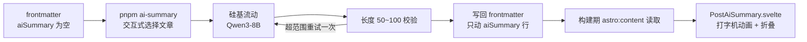

## 起因

参考站的每篇文章顶部都有一小段 AI 摘要，打字机效果逐字蹦出来，后面还缀着一个闪烁的光标，看着挺精致。眼馋，决定给自己的博客也塞一个。

拆开看，这功能其实就两块：

1. **摘要数据从哪来** —— 我选了本地脚本：调一次模型，把结果写进文章的 frontmatter
2. **前端怎么展示** —— 一个 Svelte 5 组件，负责打字机动画和移动端折叠

整体流程画出来是这样：



下面按这两条线说。

## 数据：frontmatter 里躺一个字段

没搞单独的 JSON 文件，也没上云端函数，直接在内容集合的 schema 里加了个可选字段：

```ts title="src/content.config.ts"
const postsCollection = defineCollection({
  loader: glob({ pattern: "**/*.{md,mdx}", base: "./src/content/posts" }),
  schema: z.object({
    title: z.string(),
    published: z.date(),
    description: z.string().optional().default(""),
    aiSummary: z.string().optional().default(""),
    // ...
  }),
});
```

字段可选、默认空串，没生成摘要的文章 `entry.data.aiSummary` 就是空串，页面判断一下就能决定显不显示。

为什么存 frontmatter：

- 跟着文章走，换主题、迁移仓库，摘要不会丢
- 构建期 `astro:content` 直接能读到，不需要额外请求

:::tip
aiSummary 和 description 各管各的：description 是给搜索引擎和列表页的，aiSummary 是给点进文章的人看的，文案的路子不一样，别混着用。
:::

## 生成脚本：一次调用，写回文件

脚本是一个交互式 CLI，`pnpm ai-summary` 跑起来长这样：

```text
[AI-SUMMARY] 可处理的文章：

  1. AI 文章摘要：从生成脚本到打字机组件的折腾记录
  2. 国内外分流实践：Cloudflare + EdgeOne 双端部署的踩坑记录 （已有摘要，将重写）

输入要处理的序号（多选用逗号分隔，如 1,3,5）：
```

已生成过的文章会标「已有摘要，将重写」，想重写哪篇直接再选一次就行。draft 状态和带密码的文章直接跳过，不列出。

### 读环境变量

项目脚本一直没引 dotenv，我不想为了这一个脚本破例，就自己写了个极简解析器。`.env` 其实就是 `KEY=VALUE` 逐行排开，剥掉空行、注释行和引号就完事了：

```ts
function parseEnvFile(content: string): EnvVars {
  const vars: EnvVars = {};
  for (const rawLine of content.split(/\r?\n/)) {
    const line = rawLine.trim();
    if (!line || line.startsWith("#")) continue;
    const eq = line.indexOf("=");
    if (eq <= 0) continue;
    const key = line.slice(0, eq).trim();
    let value = line.slice(eq + 1).trim();
    if (
      (value.startsWith('"') && value.endsWith('"')) ||
      (value.startsWith("'") && value.endsWith("'"))
    ) {
      value = value.slice(1, -1);
    }
    vars[key] = value;
  }
  return vars;
}
```

### 调模型

硅基流动的接口是 OpenAI 兼容的，一个 `fetch` 完事：

```ts title="scripts/generate-ai-summary.ts"
const response = await fetch(
  `${baseUrl.replace(/\/$/, "")}/chat/completions`,
  {
    method: "POST",
    headers: {
      "Content-Type": "application/json",
      Authorization: `Bearer ${apiKey}`,
    },
    body: JSON.stringify({
      model, // 默认 Qwen/Qwen3-8B
      messages: [
        { role: "system", content: PROMPT },
        { role: "user", content: `文章标题：${title}\n\n正文内容：${body}` },
      ],
      temperature: 0.5,
      max_tokens: 300,
      stream: false,
      enable_thinking: false,
    }),
    signal: AbortSignal.timeout(60_000),
  },
);
```

system prompt 里把要求写死了：**50~100 个字符、不要「本文」「这篇文章」开头的套话、直接概括核心内容、不用引号不用 markdown 不换行**。

`enable_thinking: false` 关掉思维链挺关键，不然 Qwen 先吐一大段「思考过程」，又浪费 token 又得费劲剥。不过保险起见脚本里还是做了兜底清理：剥掉 `<think>` 标签之间的内容、去首尾引号、压平空白，再进长度校验。

### 长度校验与重试

模型可不会每次都守规矩。生成完先数长度，不在 50~100 就自动重试一次；重试完还超范围，太短（20 字以下）的直接跳过不写，长度勉强能看的会弹出来问一句「是否仍写入」。

### 写回 frontmatter：只动一行

写回的逻辑有个讲究。最开始想的是把整个 frontmatter 反序列化改完再序列化回去，后来发现会破坏原文件的其他格式（比如有的字段故意写成块标量）。现在的做法是定位 frontmatter 区域，逐行找 `aiSummary:` 替换，找不到就在末尾插一行，**文件其余内容原样不动**：

```ts
function upsertAiSummary(raw: string, summary: string): string {
  const normalized = raw.replace(/\r\n/g, "\n");
  const fmMatch = normalized.match(/^---\n([\s\S]*?)\n---\n?/);
  const lines = fmMatch[1].split("\n");
  let replaced = false;
  const output: string[] = [];
  for (const line of lines) {
    if (/^aiSummary\s*:/.test(line)) {
      output.push(`aiSummary: ${toYamlDoubleQuoted(summary)}`);
      replaced = true;
      continue;
    }
    output.push(line);
  }
  if (!replaced) output.push(`aiSummary: ${toYamlDoubleQuoted(summary)}`);
  return `---\n${output.join("\n")}\n---\n${normalized.slice(fmMatch[0].length)}`;
}
```

有个细节：如果原来的值是块标量（`>` 折叠 / `|` 保留）写的，替换时得把后面的缩进续行一起吞掉，否则会残留半截 YAML。

整个脚本失败的文章跳过、不中断整批，跑完汇总：

```text
[AI-SUMMARY] 处理完成汇总：
  成功 1 篇
    - AI 文章摘要：从生成脚本到打字机组件的折腾记录
  失败 0 篇
```

:::warning
`.env` 里的 key 千万别提交进 git。脚本只从 `.env` 读，日志里也从不打印 key 相关内容。
:::

## 展示：打字机动画，和一场折叠裁切的血案

### SSR 先渲染完整文本

组件第一个版本犯了个经典错误：`displayed` 初始是空串，水合后才开始打字。结果首屏文章顶部先白一块，动画再慢慢填出来，还会带着布局跳动。

改法很朴素——SSR 阶段直接输出完整摘要，水合后再清空逐字打：

```ts
// SSR 先渲染完整文本，水合后再启动动画，避免空白与布局跳动
let displayed = $state(summary);
```

打字动画就是递归 `setTimeout` 逐字符追加，光标是一个 CSS 闪烁的 `|`。`prefers-reduced-motion` 的用户直接显示全文，不动画，这个属于基本素养。

### 窄屏折叠的血案

摘要 50~100 字，手机上还是有点长，所以加了折叠：窄屏且摘要超过阈值时用 `max-height` 裁到几行，配一个「展开全部」按钮。

问题出在折叠的初始值。当时写的是：

```ts
let isFolded = $state(true); // 一开始折叠
// [!code --]
let isFolded = $state(summary.length > foldThresholdChars); // 只有超阈值才折叠
// [!code ++]
```

而「展开全部」按钮的出现条件是 `summary.length > foldThresholdChars`。于是出现一个很蠢的组合：**短摘要（80 字以内）在手机端被裁切了，却没有展开按钮**，内容就这么永久缺一块，用户根本看不着。修复就是上面那一行：只有真正超过阈值才默认折叠，短摘要从一开始就完整展示。顺带把折叠预览高度从 4.8em 提到了 7.2em，多两行，没这么憋屈。

:::tip
折叠阈值 `foldThresholdChars` 和打字速度 `typingSpeedMs` 都放在 `src/config/aiSummaryConfig.ts`，改参数不用动组件。
:::

### 图标：离线集里没有的，自己抠

这个项目的图标走本地离线集（`src/constants/icons-data.json`），好处是零网络请求。AI 图标第一反应想用 `material-symbols:smart-toy-outline`，一查——离线集里根本没有，Icon 组件会渲染成空心圆占位。

解决：从 `@iconify-json/material-symbols` 包里的 `icons.json` 抠出这个图标的 body，塞进离线集，再用统一的 Icon 组件引用：

```tsx
<Icon icon="material-symbols:smart-toy-outline" style="font-size: 13px" />
```

## 接入：加密文章不放

在文章页 `[...slug].astro` 里，正文之前渲染：

```astro
{entry.data.aiSummary && aiSummaryConfig.enable && (
  <PostAiSummary
    client:visible
    summary={entry.data.aiSummary}
    label={aiSummaryConfig.label}
    badge={aiSummaryConfig.badge}
    typingSpeedMs={aiSummaryConfig.typingSpeedMs}
    foldThresholdChars={aiSummaryConfig.foldThresholdChars}
  />
)}
```

加密文章走的是另一个分支（EncryptedPost），那里不渲染摘要——不然密码锁着的内容先被摘要剧透完了。

## 踩坑清单

按时间顺序：

1. **dev 服务器内容不更新**：改完 frontmatter 或 schema，旧的 dev 进程内存里的内容存储感知不到变更，页面上死活没有卡片。折腾半天，重启 dev server 就好了，不用删缓存。
2. **CI 的 biome 检查红了**：本地 `pnpm lint` 带 `--write` 会自动修格式，CI 里跑的是 `biome ci`，只检查不修复。Svelte 的 `<script>` 块内容要求顶格，本地格式化完没事，推送上去就红了。写完整跑一遍 `pnpm exec biome ci ./src` 再推。
3. **折叠裁切**：上面说的，短摘要被裁且没有展开按钮，血的教训。
4. **离线图标**：别看到 `material-symbols:xxx` 就觉得有，先确认它在 `icons-data.json` 里。

## 写在最后

成本方面，Qwen3-8B 很便宜，一次摘要花不了几分钱，生成一次能管到文章大改。静态摘要的取舍也简单：确定性强、无网络依赖、构建期就有；代价是文章改版后摘要可能过时——重跑一次脚本覆盖就行。

这套东西就长在这个博客里，想照着搬的可以看仓库：

::github{repo="cuteleaf/firefly"}
