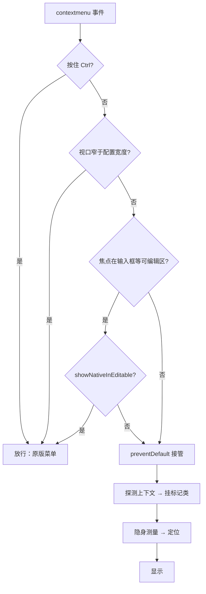

## 起因

刷别人博客的时候见过几回自定义右键菜单：右键出来的不是浏览器原版那一坨，而是主题自己画的一列选项，前进后退、复制链接、进阅读模式一应俱全。这东西不算必要功能，但点开的那一下很有「这站被人认真打理过」的感觉。决定自己也整一个。

先把想要的形态列清楚：

1. **所有菜单项走配置**。加一项、删一项、调顺序，改配置文件就行，不碰组件
2. **右键在哪，菜单不一样**。选中文本时出「复制、搜索」，链接上出「新窗口打开、复制地址」，图片上出「打开图片、复制图片地址」
3. **页面能力不同，菜单也不一样**。文章页才有「回到评论」，装了音乐播放器才出播放控制，能进阅读模式的页面才给「阅读模式」
4. **Ctrl+右键保留原版菜单**。不赶尽杀绝，偶尔还得用原版的「检查」
5. **只在桌面端生效**。窄屏和触屏没这个交互习惯，小于某个宽度直接放行

清单看着长，落到实现上其实就一句话：菜单内容是动态的，但菜单本身必须是声明式的。

## 思路：一份配置说了算

组件被压得很薄——配置决定「有什么」，运行时决定「显示什么、放哪」，CSS 只负责「藏」和「放」。

配置长这样：

```ts title="src/config/contextMenuConfig.ts"
export const contextMenuConfig: ContextMenuConfig = {
  enable: true,
  minWidth: 1024,
  // 在输入框/文本域/可编辑元素内右键时展示原版菜单
  showNativeInEditable: true,
  // 搜索选中内容用的搜索引擎，{query} 会被替换成选中文本
  searchEngine: "https://www.baidu.com/s?wd={query}",
  contextItems: {
    copySelection: true, // 有选中文本：复制
    searchSelection: true, // 有选中文本：搜索
    openLink: true, // 右键链接：新窗口打开
    copyLink: true, // 右键链接：复制地址
    openImage: true, // 右键图片：打开图片
    copyImage: true, // 右键图片：复制地址
  },
  items: [
    { action: "history-back" },
    { action: "history-forward" },
    { action: "reload", divider: true },
    { action: "music-toggle-play" },
    { action: "music-prev" },
    { action: "music-next" },
    { action: "music-volume" },
    { action: "toggle-theme", divider: true },
    { action: "reading-mode" },
    { action: "back-to-comment" },
    { action: "back-to-top" },
    { action: "copy-url" },
  ],
};
```

`items` 里每项是一个内置 action，`divider` 控制分组分隔线。想加外链或自定义行为，用 `action: "custom"` 配 `link` 或者一段函数体，图标不指定时组件会按 `item.icon ?? 默认图标` 兜底。类型在 `src/types/contextMenuConfig.ts` 里收着，配置写错了构建期就能报出来。

早期版本试过直接在模板里堆菜单节点，结果改个顺序要动模板，加一项要动模板，上下文显隐逻辑还散落在各处。收进配置之后，这些痛苦全消失了——这也是我坚持「配置驱动」最大的理由：改配置的心智负担和改组件完全不是一个量级。

## 拦截：先想清楚什么时候「不管」

写自定义菜单，最先要想清楚的不是怎么接管，而是什么时候不管。放行条件比拦截条件好写——前者每条都是独立的，后者要把所有反例串成一长串否定。

我的放行条件就三条：

```ts title="src/components/features/ContextMenu.astro"
document.addEventListener("contextmenu", (e) => {
  if (e.ctrlKey) return; // Ctrl+右键：放行原版菜单
  if (window.innerWidth < minWidth) return; // 窄屏：没这个交互
  const target = e.target instanceof Element ? e.target : null;
  const isFormField =
    !!target?.closest("input, textarea, select") ||
    (target instanceof HTMLElement && target.isContentEditable);
  if (isFormField && showNativeInEditable) return; // 输入框里：原版菜单更好用
  e.preventDefault();
});
```

流程画出来是这样：



另外两个工程细节：绑定前先检查 `window.__fireflyContextMenu` 防止重复挂监听（Astro 页面脚本在某些跳转场景会重新执行，不设防会越绑越多）；关菜单的途径比开菜单多得多——点遮罩、Esc、窗口失焦、滚动、resize、路由跳转全都要收尾，其中滚动监听用 capture 加 passive 就够了，反正目的只是把菜单收起来。

这段代码里埋着本篇坑二的祸根，先按下不表。

## 上下文感知：两组标记类

探测上下文，说穿了就是把一堆布尔判断折算成根元素上的类名：

```ts title="src/components/features/ContextMenu.astro"
// 右键位置：点在哪
menu.classList.toggle("show-selection", hasSelection);
menu.classList.toggle("show-link", !!link);
menu.classList.toggle("show-image", !!img);
// 页面能力：这页有什么
menu.classList.toggle("ctx-has-music", typeof music()?.getState === "function");
menu.classList.toggle("ctx-has-comments", !!document.getElementById("post-comments"));
menu.classList.toggle("ctx-has-reading", isReadingModeAvailable());
```

两组前缀语义不同：`show-*` 描述「右键点在哪」，每次打开都重新探测；`ctx-has-*` 描述「这个页面有什么能力」。CSS 那边配合很机械——扩展项默认藏起来，标记类出现才放行：

```stylus title="src/components/features/ContextMenu.astro（样式部分）"
#context-menu
    .ctx-need-selection
        display: none
    &.show-selection
        .ctx-need-selection
            display: flex
```

注意第三行的 `&`，它是坑一的主角，后面细说。

能力探测里有几个值得展开的点：

音乐播放器是 Svelte island，把实例挂到 `window.__fireflyMusic` 上。但 island 水合有时机问题——页面刚开就右键，这个全局对象可能还不存在；就算存在了，也得确认它真能用。所以探测写成 `typeof getState === "function"` 而不是简单判存在：对象在、方法还没挂上的窗口期里，单纯判存在会误报。

评论区探测最朴素：`document.getElementById("post-comments")` 找得到节点就有评论。因为评论区只渲染在文章页，这一行天然把「文章页」的语义带上了，不用再判断路径。

阅读模式的判断和站内阅读模式按钮共用同一个谓词：路径在 `/posts/` 下且视口够宽。两处逻辑一个标准，避免「按钮说能进、菜单里却没有」的尴尬。

## 定位：先隐身，量完再现身

弹出位置看着五分钟搞定，实际有个经典陷阱：菜单贴近屏幕右缘时，音量条那组二级菜单会探出屏幕。等渲染出来再发现溢出，视觉上就是闪一下。

做法是显示之前先隐身量尺寸：

```ts title="src/components/features/ContextMenu.astro"
const SUBMENU_SPACE = 240; // 给二级菜单留的空间

menu.classList.remove("hidden", "ctx-flip-left");
menu.style.visibility = "hidden";
const rect = menu.getBoundingClientRect();
const flipLeft = x + rect.width + SUBMENU_SPACE > vw;
if (flipLeft) menu.classList.add("ctx-flip-left");
menu.style.visibility = "";
```

关键在用 `visibility: hidden` 而不是 `display: none`——前者占据布局、能量出真实尺寸，后者量出来全是 0。量完该翻转就加 `ctx-flip-left` 让二级菜单朝左开，最后再去掉隐身。整个过程在同一帧内完成，肉眼看不到闪。

## 明暗适配

这部分反而最省心：颜色全部走站内 CSS 变量，`var(--card-bg)`、`var(--btn-regular-bg-hover)` 这类，主题切换时变量一变菜单自动跟上。唯一手写的是深色模式下的文字颜色，站内惯例是 `:global(.dark)` 里配一个半透明白，照抄即可。

## 踩坑清单

下面按踩到的顺序讲三个坑。共同点是：每一个的现象都在暗示「代码是对的」，而真凶全在别处。

### 坑一：Stylus 嵌套少写一个 &，样式全灭

现象：文章页右键，音乐控制和阅读模式死活不出现。DevTools 里看元素，`ctx-has-music` 标记类明明白白挂在根元素上，对应的 CSS 规则也能搜到——就是不生效。

当时的排查动作是拿源码里的选择器去控制台对元素做 `matches()` 验证，结果永远是 false，一度把我带偏到怀疑类名拼错。后来才反应过来：Astro 的 scoped style 编译时会往每一段选择器里塞 `data-astro-cid-xxx` 属性，源码里的 `#context-menu .ctx-has-music` 和运行时真实的选择器根本不是同一串字符。**调样式问题，看编译产物，别看源码。**

编译产物（简化了无关细节）长这样：

```css title="编译产物：坏的"
#context-menu[data-astro-cid-mdguodk3] .ctx-has-music .ctx-need-music {
  display: flex;
}
```

而实际的 DOM 结构是这样的：

```html title="简化后的结构"
<div id="context-menu" class="ctx-has-music" data-astro-cid-mdguodk3>
  <div class="ctx-need-music">音量</div>
</div>
```

看出问题了吗？坏的选择器要求 `.ctx-has-music` 是 `#context-menu` 的**后代**，可这个类挂在根元素自己身上，后代里根本不存在——这条规则永远匹配不到任何元素，于是菜单项一直保持 `display: none`。

根源在 Stylus 嵌套少写了一个 `&`：

```stylus title="错：第一层没有 &"
#context-menu
    .ctx-has-music
        .ctx-need-music
            display: flex
```

```stylus title="对：&. 连写在根元素上"
#context-menu
    &.ctx-has-music
        .ctx-need-music
            display: flex
```

一字之差，编译产物从「空格分隔找后代」变成「连写找自身」：

```css title="编译产物：对的"
#context-menu[data-astro-cid-mdguodk3].ctx-has-music .ctx-need-music {
  display: flex;
}
```

:::tip
Astro/Stylus 里凡是「状态类挂在容器根上、控制后代显隐」的写法，嵌套第一层必须 `&` 开头。写完别信源码，去编译产物里确认一眼。
:::

### 坑二：布尔守卫写反了

`showNativeInEditable` 这个配置，本意是「输入框里右键用原版菜单」。第一版代码：

```ts title="src/components/features/ContextMenu.astro"
if (isFormField && !showNativeInEditable) return; // [!code --]
if (isFormField && showNativeInEditable) return; // [!code ++]
```

单看每一半都没错：`isFormField` 判断是 Copy 来的没毛病，`showNativeInEditable` 字段名也没拼错。但把条件念出来就露馅了——「在输入框里，**且** 配置说要用原版菜单，所以放行」，念成第一版就是「配置开着，反而拦截」，语义整个颠倒。

这个 bug 的刁钻之处在于：默认配置下功能「看起来正常」，只是输入框里也弹自定义菜单；要不是特意去输入框里右键试了一把，可能很久都发现不了。

后来养成的自查习惯：布尔条件写完念一遍。比如「如果 A 且非 B，放行」翻译成人话是「B 开着反而拦着」——一念就穿帮。

### 坑三：dev 里好好的，preview 里菜单缺项

最玄学的一个。源码翻来覆去看没问题，dev 服务里右键 12 项全出；切到 `pnpm preview`，音乐控制和阅读模式没了，连样式都对不上。

第一反应是「preview 模式行为不一样」——还真不是。真相是：

`astro preview` 只伺服上次 `astro build` 产出的 `dist/`，它自己不编译任何东西。而那份 `dist/` 是坑一修复**之前**构建的，里面躺着的还是缺 `&` 的坏选择器。dev 实时编译所以一直是对的，preview 开的是罐头所以一直是旧的。

验证方法也简单：直接翻 `dist/_astro/*.css`，拿「连写」的正确形态去搜，搜不到；拿「后代链」的坏形态一搜一个准。罐头内容和菜谱对不上，问题就不在菜谱。

:::warning
排查样式问题前先问自己一句：**我看到的是哪份代码？** dev 反映源码，preview 反映上次构建，部署环境反映更早的构建。三者不同步时，现象会互相矛盾，但每一份都如实反映了它对应的那份代码。改完记得重新 build，别让旧产物陪跑。
:::

## 写在最后

右键菜单是典型的「平时没人看，写起来细节不少」的功能。回头看，思路层面就三件事：放行条件先于拦截条件想清楚、状态折算成标记类交给 CSS、量完尺寸再显示。剩下的坑大多出在源码和运行时之间的那些层上——Stylus 会编译选择器，Astro 会改写选择器，preview 伺服的是历史产物。每一层都在帮忙，也都在让你离真相远一步。

主题完整代码在这里：

::github{repo="cuteleaf/firefly"}
