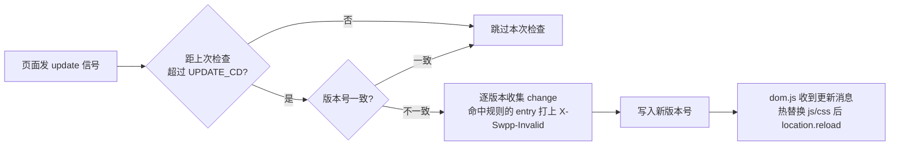

## 起因

博客是纯静态站，内容基本不变，但图片字体一堆，每次访问都回源有点浪费；偶尔断网，也想让看过的东西还能打开。于是动了加 Service Worker 的念头。

目标先列清楚：

1. **静态资源少回源**，但不要「缓存一切」的黑盒
2. **页面能离线访问**，可这必须是精确控制的副产品，不是拿全站预缓存换的
3. **发新文章后老访客要能尽快看到**，不能永久困在旧页面里
4. **出问题要能一键撤退**，不至于把用户锁死在坏缓存上
5. **整个开关走配置**，`src/config` 里一行 `enable: false` 就能下掉

第一反应是 Workbox：generateSW 一把梭，manifest 预缓存全站 + runtime 正则。但它的默认心智是「能缓存就缓存，更新靠版本号整体替换」，规则写起来是正则集合，跟我的诉求有点错位。翻到 swpp 的时候，它文档里那句「缓存控制是主业，离线只是副作用」正中下怀——于是就有了这篇。

## swpp 是什么：规则驱动的缓存

swpp（npm 包叫 `swpp-backends`，文档在 https://swpp.kmar.top/）跟 Workbox 最大的区别在心智模型上。Workbox 默认生成一份资源清单，把「要不要缓存、什么时候过期」交给一套运行时逻辑；swpp 反着来——**默认不缓存**，每个请求进不进缓存、进了怎么失效，都由一段显式的判定函数说了算。

### 缓存协议：false 与 -1

swpp 的规则返回值语义很简单，但和直觉相反的地方恰恰在这里：

```ts
// 返回 false —— 不缓存，每次照常走网络
// 返回 -1  —— 永久缓存，且不参与 swpp 的版本更新检查
function matchCacheRule(url: URL): number | false;
```

`-1` 看着像「永远缓存」，实际上它真正的意思是「**这份资源信任文件名就是版本，交给 swpp 管反而多余**」。所以它只适合两类东西：

- 文件名带内容哈希的构建产物（如 `/_astro/*.js`），内容一变文件名必变，旧引用自然失效
- 由版本号机制统一失效的 HTML 页面

其余资源——API、跨域资源、任何会原地更新的东西——一律 `false`，别指望 SW 替你兜底。

### 版本号驱动失效：update.json

离线是副产品，那新内容怎么推送？swpp 的做法是给缓存引入「版本」概念。生成的 sw.js 里藏着几个关键常量：

```js
const CACHE_NAME = "kmarBlogCache";
const UPDATE_JSON_URL = "swpp/update.json";
const VERSION_PATH = "https://id.v3/"; // 版本元数据以特殊 key 存在 Cache Storage
const INVALID_KEY = "X-Swpp-Invalid";  // 失效标记，打在待更新的缓存 entry 上
const UPDATE_CD = 600000;              // 两次版本检查的最小间隔（10 分钟）
```

SW 收到页面发来的更新信号后，会拉一份 `swpp/update.json`（构建期生成），把里面的版本号和自己存下的版本号做比较：



三个值得记住的兜底行为：

- **首访用户**没有旧版本号，直接返回 -1，按当前规则铺缓存，不参与比较
- **版本号整体丢失**（比如缓存被浏览器清了但 SW 还在）时，干脆清空整个 `CACHE_NAME` 重来
- **逃生门 escape**：构建期由 `defineCrossEnv` 注入到 sw.js，跨版本协议大改时用来兜底

:::tip
这套设计最舒服的一点：发新文章后，`update.json` 里只多一条「这份 HTML 变了」的记录，而不是把整站资源重新下发一遍。增量，而不是全量。
:::

## 白名单怎么定：一份判断，两端执行

规则是协议的核心，所以它不能只活在浏览器里。swpp 要求把判定函数写进配置，让 **Node 端（构建期算增量）** 和 **浏览器端（运行时真拦截）** 各有一份实现，这就是 `defineCrossDep` 的由来：

```ts title="swpp.config.ts（节选）"
defineCrossDep({
  matchCacheRule: {
    // 浏览器端实现：swpp 通过 toString() 将此函数序列化进 sw.js
    runOnBrowser: (url: URL): number | false => {
      const { pathname } = url;
      if (url.origin !== self.location.origin) return false; // 跨域永不缓存
      if (pathname.startsWith("/api/")) return false;        // 动态接口不缓存
      if (pathname.startsWith("/_astro/") || pathname.startsWith("/pagefind/")) {
        return -1; // 文件名即版本，永久缓存
      }
      if (pathname.endsWith("/") || pathname.endsWith(".html")) return -1;
      if (/\.(?:html|woff2?|ttf|otf|png|jpe?g|webp|avif|svg|gif|ico)$/i.test(pathname)) {
        return -1; // 字体、图片等静态媒体
      }
      return false;
    },
    // Node 端实现：构建时计算增量更新规则，允许复用模块作用域
    runOnNode: (url: URL) => matchCacheRuleByUrl(url, SITE_ORIGIN),
  },
});
```

具体到我们这个站，白名单就三条线：

1. **跨域直接放行**。友链头像、第三方图床这些资源，SW 管不着也不该管
2. **`/_astro/*` 与 `/pagefind/*` 给 -1**。这些是构建产物，文件名带内容哈希，命中即永远命中
3. **HTML 与静态媒体给 -1**。媒体靠哈希、靠 CDN 头；HTML 不靠哈希，靠的是上面那套版本号机制来失效

:::warning
注意 Node 端走的是 `SITE_ORIGIN` 这种模块作用域常量（`runOnNode` 在构建期运行），浏览器端却只能拿 `self.location.origin` 现算。两端行为不一致时不会报错，只会表现为「构建算出来的增量规则和浏览器实际执行的规则对不上」——这类漂移极难排查，改规则时务必两端一起改。
:::

## 构建编排：注入与产物

`swpp-backends` 的构建期产物是固定的：站点根目录的 `sw.js`，加 `swpp/` 目录下的 `update.json`、`tracker.json`、`dom.js`。其中 `dom.js` 是官方提供的前端更新接收脚本：页面加载后如果 SW 已接管，就发个 update 信号；收到「有更新」的消息后，配合 Pjax 先热替换改动的 `<script>`/`<link>`，再 `location.reload()`——刷新前写 sessionStorage 标记，防止 reload 死循环。

剩下还有两件事得自己编排，我写在 `scripts/build-swpp.ts` 里：

**第一，把注册脚本注入每个 HTML。** 位置和 swpp CLI 保持一致：`<script>(${registry})()</script>` 紧跟 `<head>` 开标签之后，`<script defer src="/swpp/dom.js">` 贴在 `</head>` 之前：

```ts title="scripts/build-swpp.ts（节选）"
const registry: string = runtimeData.domConfig.read("registry");
const registryScript = `<script>(${registry})()</script>`;
const domScript = `<script defer src="/swpp/dom.js"></script>`;

// 幂等：已包含 dom.js 引用说明注入过，跳过
if (html.includes(DOM_JS_URL)) continue;
```

**第二，留一条撤退路线。** 配置里 `enable: false` 时不生成 swpp 产物，而是往 `sw.js` 写一段「自杀 SW」：activate 时清空全部缓存、注销自身、刷新所有受控页面。想下掉这个功能，改一行配置、重新构建部署，老访客下次打开就自动回归无 SW 状态，不用等任何 TTL。

## 出问题点

流程捋顺了，下面这些坑是实际集成时一个一个踩出来的，按折磨程度排序。

### 坑一：saveFiles 撞上已存在文件，直接抛 file_duplicate

第一次跑构建一切正常，第二次跑同一份 `dist/` 就直接炸。翻 `swpp-backends` 源码，`saveFiles` 对「文件已存在」的处置不是覆盖，而是**抛 `file_duplicate` 异常**。

这其实是个守护设计：`publicPath` 指向的就是站点根目录，里面本来就躺着别人写的文件，无脑覆盖太危险。但对我们的构建流程来说，`swpp/` 产物每次都是重新生成的，旧的必须清掉。解法很朴素——先删后写：

```ts title="scripts/build-swpp.ts（节选）"
const files = await builder.buildFiles();
// saveFiles 对已存在的文件会抛 file_duplicate，先清掉上次构建可能遗留的产物
await Promise.all(
  files.map((file) => fs.rm(file.path.absPath, { force: true })),
);
await builder.saveFiles();
```

:::tip
教训：遇到「第二次构建才报错」的诡异现象，先想想是不是产物落盘逻辑把上一次的东西当成了「别人的文件」。
:::

### 坑二：注入成功的前提是「结构完整的 head」

注入脚本找的是 `<head ...>` 开标签和它之后的 `</head>`：

```ts title="scripts/build-swpp.ts（节选）"
const openTag = /<head[^>]*>/i.exec(html);
if (!openTag) return null;
const closeStart = html.toLowerCase().lastIndexOf("</head>");
if (closeStart < openEnd) return null;
```

任何一边缺了，`injectHead` 就返回 `null`，构建日志里只多一行：

```
⚠ Skipped ${file}: no <head> found
```

Astro 正常产出的页面没问题，但自定义输出、纯脚本生成的页面一旦结构不完整，就会被**静默跳过**——SW 注册脚本没进去，那一页就成了缓存盲区。坑不在实现，在于它太安静了。所以注入完我特意数了成功数打日志，`injected: n/total` 对不上就立刻查。

另一个相关细节是幂等：`html.includes(DOM_JS_URL)` 命中就直接跳过，保证脚本重复执行不会给页面塞两份注册代码。

### 坑三：runOnBrowser 是被 toString 的裸函数，别惦记闭包

这是最反直觉的一个。`runOnBrowser` 的实现会被 swpp **整个序列化（toString）后嵌进生成的 sw.js**——函数体之外的一切都带不走：闭包变量、外层常量、import 进来的东西，全都不存在。

我第一次写的时候，习惯性地在函数体里引用了 `SITE_ORIGIN`，构建一点错不报，浏览器里跑起来就是 `undefined !== undefined` 之类的诡异比较。排查了很久才意识到：**那个函数在 sw.js 里是孤零零的一段源码，它只认识自己函数体里的东西。**

所以写法上要遵守两条：

1. `runOnBrowser` 函数体必须**自包含**，要判断同源就现场算 `self.location.origin`
2. `runOnNode` 运行在构建期 Node 环境，随便复用模块作用域——但别忘了它和浏览器端**必须产出一致的判定结果**

### 坑四：-1 是「永久缓存」，不是「永不变」

一开始想偷懒，把所有资源都返回 -1，想着「缓存越多越离线」。结果发现 -1 的资源**不参与版本检查**，意味着它一旦进了缓存，就只有靠它自己的 URL 变化才会被替换。

- 对 `/_astro/*` 这种带内容哈希的产物，这没问题——文件变了 URL 必变
- 对**固定 URL 的资源**，这就是灾难：内容更新了，URL 没变，swpp 版本机制又不检查它，用户将永远看到旧文件

所以 -1 的正确用法是且仅是「文件名即版本」的资源；任何「URL 不变但内容会变」的东西，要么交给版本机制失效，要么干脆不缓存。HTML 之所以能 -1，是因为它不在版本机制之外——HTML 恰恰是版本号要盯的主要对象。

### 坑五：HTTP 缓存头不配合，版本检查会失灵

swpp 的更新链路依赖「SW 每次能拿到新鲜的 `sw.js` 和 `update.json`」。部署端要是给这两个文件套上长缓存，SW 检查到的版本号永远是旧的，等于版本机制整个失灵。而 `/_astro/*` 这类产物则反过来，巴不得 CDN 层就给足缓存，SW 都不必每次都回源。

所以部署在 Cloudflare Pages 时，`_headers` 里必须给出截然相反的两段：

```text title="public/_headers"
/sw.js
  Cache-Control: no-cache, must-revalidate
/swpp/*
  Cache-Control: no-cache, must-revalidate
/_astro/*
  Cache-Control: public, max-age=31536000, immutable
```

:::warning
改完 swpp 相关代码后，如果线上迟迟不生效，先查的不是代码，是这两个文件的 HTTP 响应头。no-cache 写没写对，直接影响用户多久能拿到新版本。
:::

### 坑六：验证 SW 永远慢半拍

SW 的更新节奏和普通前端完全不一样，第一次接触很容易被它的「慢半拍」绕进去：

1. **首次访问**只是注册 + install，页面还没被接管
2. **刷新一次**后 activate 接管，之后的请求才走缓存
3. 新版本的 sw.js 下载后可能处于 **waiting** 状态，要等旧页面全部关闭才接管
4. `dom.js` 刷新前还有 sessionStorage 防死循环标记，一个 session 里只刷新一次

把这些叠在一起，实际效果是：改了规则 → build → 刷新 → 看效果，**不是**原子动作。你可能刷到的是仍被旧 SW 喂着的旧页面，而新 SW 正安静地等在后台。

再叠加一个老熟人——`astro preview` 只伺服上次 build 产出的 `dist/`，不编译任何东西。如果 build 都没重新跑，你验的压根不是刚写的代码。所以正确的验证姿势是：

1. 先 `pnpm build` 再 `pnpm preview`，确认 dist 是新的
2. 打开开发者工具 Application 面板看 SW 状态，必要时手动 Skip waiting
3. 要彻底重来就直接 Unregister + Clear storage，从头走一遍首访流程

:::tip
改一次规则要 build、preview、unregister、reload 四个动作，才能干净地验证一轮。嫌烦就写进自己的检查清单——SW 的「缓存要几跳才生效」特性，决定了它没法像普通代码那样热改热验。
:::

## 写在最后

回头看，swpp 真正的门槛不在配置，而在**心智转换**：它默认什么都不缓存，规则返回值的每个分支都要你回答「这份资源变了以后，靠什么失效」——靠文件名哈希、靠版本号机制，还是根本不缓存。把这个问题想清楚，剩下的实现都是水到渠成；想不清楚，就会在「怎么不生效」「怎么老不更新」之间反复横跳。

集成期的坑也大多长在这个心智缝隙里：序列化的函数没有闭包、永久缓存不等于永不变、HTTP 头能废掉版本检查、SW 的验证天然慢半拍。每一个都是「某一层帮你做了件事，但没告诉你」。

swpp 本身是个很克制也很完整的方案，作者 kmar 的文档写得值得通读，仓库在 EmptyDreams/swpp-backends。博客这边从配置到构建编排的完整实现都在：

::github{repo="kmoretti/firefly"}
